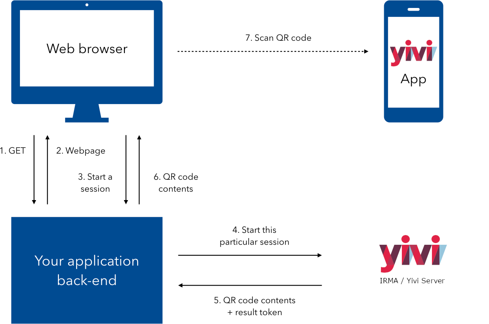
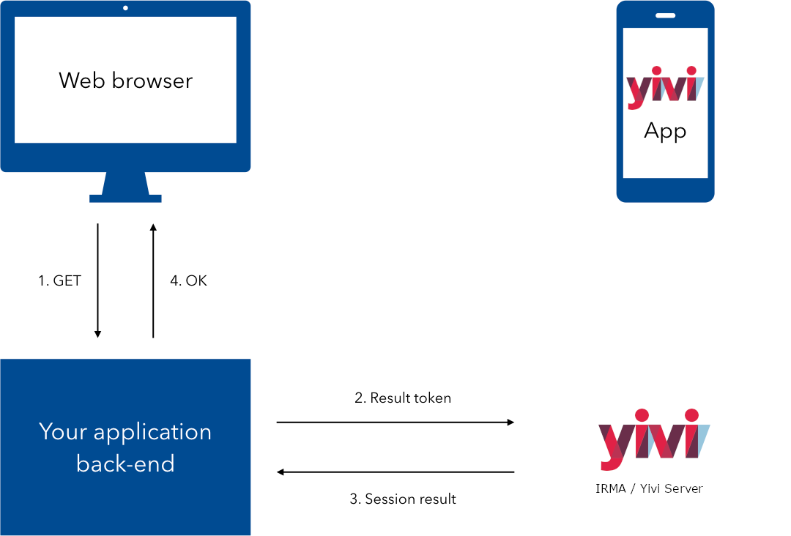
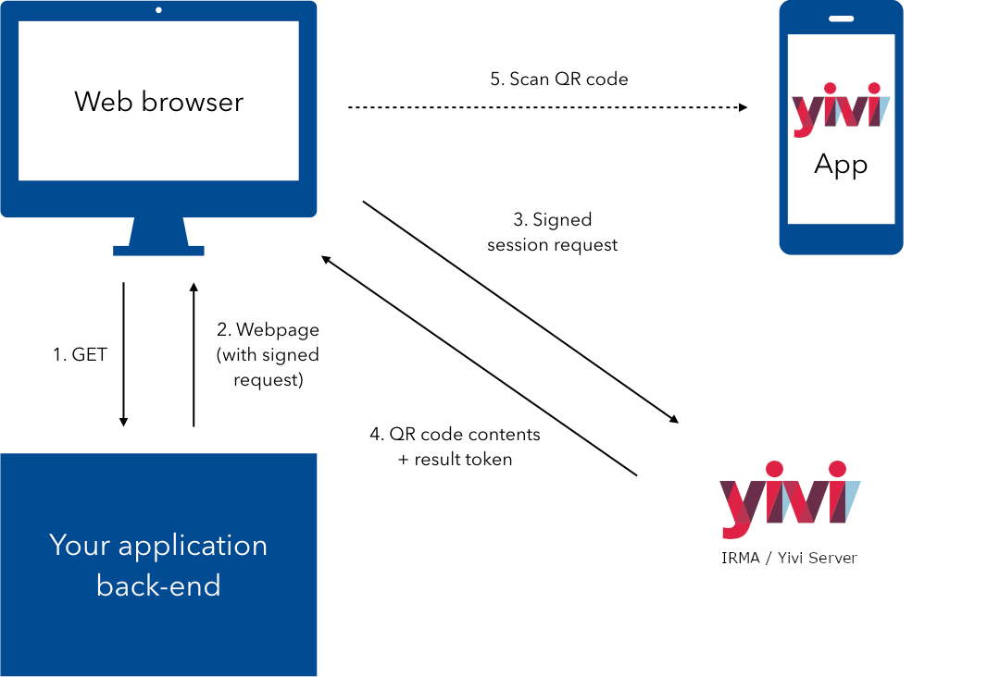
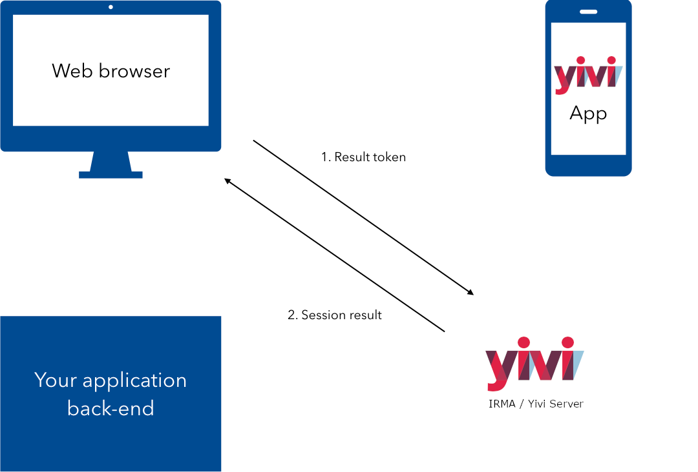

# IRMA frontend packages

Welcome to this repository! IRMA frontend packages is a collection of related
packages, that together form a Javascript "client" to the IRMA server. The
primary purpose of these packages is to have a very flexible IRMA client in the
web browser, but you can also use them to build a NodeJS client.

The browser version, by default, will look like this:


The client is designed in such a way that you can combine the plugins you need
and configure them in many useful ways. So the above design can easily be
removed (for your NodeJS application) or swapped out for a popup version.

## Supported IRMA flows

This library is designed to be flexible in usage. In this section we describe
how some imaginable IRMA flows and how these flows map onto this library. We
also mention points of attention for developers when implementing such a flow.

As a general best practice, we don't want to allow the web browser to freely
initialize the IRMA flow. Also, in many cases we don't want the result of the
disclosure or signing request to be revealed to the browser. The code that is
running in the web browser could be compromized by the user or third party
injected code.

### Talking to IRMA server through a proxy

The most highly recommended flow that combats these issues
is one where the Javascript client talks to the IRMA server through your own
application back-end, that functions as a proxy.


_Starting a session through a proxy_

In this flow the IRMA Javascript client requests the back-end for a new session
to be started, and it is the back-end that actually starts the session. In this
flow the web browser can't manipulate the session that gets started or see the
contents of the resulting disclosure:


_Getting the session result through a proxy_

<details>
  <summary>How to implement this flow</summary>

  #### Client side

  You can use either the wrapper package [`irma-frontend`](irma-frontend) or
  combine your own packages if you have a build system like webpack.

  ##### `irma-frontend`

  ```html
<script type="text/javascript" src="[link to irma-frontend, see its readme]"></script>

<script type="text/javascript">
  const irmaWeb = irma.newWeb({
    debugging: false,            // Enable to get helpful output in the browser console
    element:   '#irma-web-form', // Which DOM element to render to

    // Back-end options
    session: {
      // Point this to your controller:
      url: 'https://my-server.domain/irma-endpoint',

      start: {
        url: o => `${o.url}/start`,
        method: 'GET'
      },
      result: {
        url: (o, {sessionPtr, sessionToken}) => `${o.url}/result`,
        method: 'GET'
      }
    }
  });

  irmaWeb.start()
  .then(result => console.log("Successful disclosure! 🎉", result))
  .catch(error => console.error("Couldn't do what you asked 😢", error));
</script>
  ```

  ##### Combining your own packages

  ```bash
$ npm install --save-dev irma-css irma-core irma-web irma-client
  ```

  ```javascript
require('@privacybydesign/irma-css');

const IrmaCore = require('@privacybydesign/irma-core');
const Web      = require('@privacybydesign/irma-web');
const Client   = require('@privacybydesign/irma-client');

const irma = new IrmaCore({
  debugging: false,            // Enable to get helpful output in the browser console
  element:   '#irma-web-form', // Which DOM element to render to

  // Back-end options
  session: {
    // Point this to your controller:
    url: 'https://my-server.domain/irma-endpoint',

    start: {
      url: o => `${o.url}/start`,
      method: 'GET'
    },
    result: {
      url: (o, {sessionPtr, sessionToken}) => `${o.url}/result`,
      method: 'GET'
    }
  }
});

irma.use(Web);
irma.use(Client);

irma.start()
.then(result => console.log("Successful disclosure! 🎉", result))
.catch(error => console.error("Couldn't do what you asked 😢", error));
  ```

  #### Server side

  Then, on the server side, you have to implement the `start` and `result`
  actions on your `irma-endpoint` controller.

  `start` should make a call to the IRMA server and start the IRMA session
  there. Then, strip the result token from the response JSON and send the rest
  back in the response to the client.

  `results` can fetch the result from the IRMA server using the result token
  that we stripped off the response earlier. Whatever you return to the client
  will be what the Promise on the last few lines resolves to.

  As you saw in the snippets above, you can change the request types and URLs of
  both actions. But you can also change the request body, headers and how to get
  the QR code from the server's response. See the
  [`irma-client`](plugins/irma-client) documentation for details.
</details>

### Talking to IRMA server directly, with signed request

Another supported flow is one where the Javascript client talks to the IRMA
server directly, and is itself responsible for starting the session there.


_Starting a session directly, with signed request_

The payload that gets sent to the IRMA server to start the session is signed by
your application back-end, so the web browser can't alter the request and the
IRMA server can verify its authenticity.

However, the web browser will be able to see the resulting disclosure or signed
contract, because the web browser will be the one receiving the result token
from the IRMA server. This may be an issue for some scenario's.
In these scenarios you can get [signed JWTs as result](https://irma.app/docs/irma-server/#signed-jwt-session-results)
from the IRMA server. This flow with receiving JWTs as result is not
elaborated in this example.


_Getting the session result directly_

<details>
  <summary>How to implement this flow</summary>

  #### Client side

  You can use either the wrapper package [`irma-frontend`](irma-frontend) or
  combine your own packages if you have a build system like webpack.

  ##### `irma-frontend`

  ```html
<script type="text/javascript" src="[link to irma-frontend, see its readme]"></script>

<script type="text/javascript">
  const irmaRequest = 'signed request here';

  const irmaWeb = irma.newWeb({
    debugging: false,            // Enable to get helpful output in the browser console
    element:   '#irma-web-form', // Which DOM element to render to

    // Back-end options
    session: {
      // Point this to your IRMA server:
      url: 'https://irma-server.my-server.domain/',

      start: {
        method: 'POST',
        body: irmaRequest,
        headers: { 'Content-Type': 'text/plain' },
      }
    }
  });

  irmaWeb.start()
  .then(result => console.log("Successful disclosure! 🎉", result))
  .catch(error => console.error("Couldn't do what you asked 😢", error));
</script>
  ```

  ##### Combining your own packages

  ```bash
$ npm install --save-dev irma-css irma-core irma-web irma-client
  ```

  ```javascript
require('@privacybydesign/irma-css');

const IrmaCore = require('@privacybydesign/irma-core');
const Web      = require('@privacybydesign/irma-web');
const Client   = require('@privacybydesign/irma-client');

const irmaRequest = document.getElementById('irma-request').value;

const irma = new IrmaCore({
  debugging: false,            // Enable to get helpful output in the browser console
  element:   '#irma-web-form', // Which DOM element to render to

  // Back-end options
  session: {
    // Point this to your IRMA server:
    url: 'https://irma-server.my-server.domain/',

    start: {
      method: 'POST',
      headers: { 'Content-Type': 'application/json' },
      body: irmaRequest
    }
  }
});

irma.use(Web);
irma.use(Client);

irma.start()
.then(result => console.log("Successful disclosure! 🎉", result))
.catch(error => console.error("Couldn't do what you asked 😢", error));
  ```

  #### Server side

  On the server side you have to render the signed request in your view, or
  provide some other method of getting the signed request to the client. This is
  left as an exercise for the reader, because there are too many ways in which
  to do it.

  The Promise in the last few lines of the code above will now resolve to the
  result of the disclosure or signing flow. Please note that it is now also up
  to you to transfer this information to your back-end **and also to check that
  the result has been properly signed by your IRMA server** and the browser has
  not altered the results in any way.
</details>

### Talking to IRMA server directly, with plain request

This flow is "tolerated" but not recommended in the browser. It's useful for
making quick demos and for local development, but is probably not a good idea
for production. Unless you're writing a NodeJS client, maybe.

The Javascript client talks directly to the IRMA server and starts an arbitrary
session there. The back-end does not need to be involved at all.

<details>
  <summary>How to implement this flow</summary>

  You can use either the wrapper package [`irma-frontend`](irma-frontend) or
  combine your own packages if you have a build system like webpack.

  ##### `irma-frontend`

  ```html
<script type="text/javascript" src="[link to irma-frontend, see its readme]"></script>

<script type="text/javascript">
  const irmaWeb = irma.newWeb({
    debugging: false,            // Enable to get helpful output in the browser console
    element:   '#irma-web-form', // Which DOM element to render to

    // Back-end options
    session: {
      // Point this to your IRMA server:
      url: 'https://irma-server.my-server.domain/',

      start: {
        method: 'POST',
        headers: { 'Content-Type': 'application/json' },
        body: JSON.stringify({
          '@context': 'https://irma.app/ld/request/disclosure/v2',
          'disclose': [
            [
              [ 'pbdf.pbdf.email.email' ],
              [ 'pbdf.sidn-pbdf.email.email' ],
            ]
          ]
        })
      }
    }
  });

  irmaWeb.start()
  .then(result => console.log("Successful disclosure! 🎉", result))
  .catch(error => console.error("Couldn't do what you asked 😢", error));
</script>
  ```

  ##### Combining your own packages

  ```bash
$ npm install --save-dev irma-css irma-core irma-web irma-client
  ```

  ```javascript
require('@privacybydesign/irma-css');

const IrmaCore = require('@privacybydesign/irma-core');
const Web      = require('@privacybydesign/irma-web');
const Client   = require('@privacybydesign/irma-client');

const irma = new IrmaCore({
  debugging: false,            // Enable to get helpful output in the browser console
  element:   '#irma-web-form', // Which DOM element to render to

  // Back-end options
  session: {
    // Point this to your IRMA server:
    url: 'https://irma-server.my-server.domain/',

    start: {
      method: 'POST',
      headers: { 'Content-Type': 'application/json' },
      body: JSON.stringify({
        '@context': 'https://irma.app/ld/request/disclosure/v2',
        'disclose': [
          [
            [ 'pbdf.pbdf.email.email' ],
            [ 'pbdf.sidn-pbdf.email.email' ],
          ]
        ]
      })
    }
  }
});

irma.use(Web);
irma.use(Client);

irma.start()
.then(result => console.log("Successful disclosure! 🎉", result))
.catch(error => console.error("Couldn't do what you asked 😢", error));
  ```
</details>

### Skipping the server altogether for development

For development or testing purposes it is often easier to just skip having an
IRMA server at all. You can use the [`irma-dummy`](plugins/irma-dummy) package
to this end.

<details>
  <summary>How to implement this flow</summary>

  ```bash
$ npm install --save-dev irma-css irma-core irma-web irma-dummy
  ```

  ```javascript
require('@privacybydesign/irma-css');

const IrmaCore = require('@privacybydesign/irma-core');
const Web      = require('@privacybydesign/irma-web');
const Dummy    = require('@privacybydesign/irma-dummy');

const irma = new IrmaCore({
  debugging: false,            // Enable to get helpful output in the browser console
  element:   '#irma-web-form', // Which DOM element to render to
  dummy:     'happy path'      // Specify which flow to emulate
});

irma.use(Web);
irma.use(Dummy);

irma.start()
.then(result => console.log("Successful disclosure! 🎉", result))
.catch(error => console.error("Couldn't do what you asked 😢", error));
  ```

  See [`irma-dummy`](plugins/irma-dummy) for more options.
</details>

## Additional documentation

Want to know more about any of the packages? Each package has its own README
file with features, options and purpose of the package:

* [`irma-core`](irma-core)
* [`irma-css`](irma-css)
* [`irma-frontend`](irma-frontend)
* [`irma-legacy` / `irmajs`](irma-legacy)
* Front-end plugins
  * [`irma-console`](plugins/irma-console)
  * [`irma-popup`](plugins/irma-popup)
  * [`irma-web`](plugins/irma-web)
* Back-end plugins
  * [`irma-dummy`](plugins/irma-dummy)
  * [`irma-client`](plugins/irma-client)

### Building
Some of the modules needs building steps before you can use them. If you are building
this library from source, you have to perform those steps yourself. We provide you
the bash script `build.sh` that builds every library automatically. You have to run
this in the root directory of this repository.

```
./build.sh
```

Be aware that the packages are built using the dependencies from `npm`, If you make
local changes in one package, the changes are not automatically included into other
packages that use the changed package as dependency. If you do want to fully build
locally with local changes, check the [development guide](#development).

If you need to build one specific package and the general script is not suitable to you,
then you can look at the README of the particular package for package specific instructions.

### Examples

Also, we have several examples available that show how you can use specific
combinations of plugins to achieve different effects:

* Web browser
  * [`irma-console`](examples/browser/irma-console)
  * [`irma-frontend`](examples/browser/irma-frontend)
  * [`irma-popup`](examples/browser/irma-popup)
  * [`irma-web`](examples/browser/irma-web)
  * [`irma-legacy`](examples/browser/irma-legacy)
* Nodejs
  * [`irma-console`](examples/node/irma-console)
  * [`irma-legacy`](examples/node/irma-legacy)
* Back-ends
  * [`irma-client`](examples/backends/irma-client)

### Development
When developing a certain module, you might want to test the module using one of the examples.
By default the examples load their dependencies via npm, so if you want to run an example
with your own code you have to use `npm link`. This also holds for the packages `irma-frontend`
and `irma-legacy`, which use other `irma-frontend-packages` as dependencies.

For example, when you are developing the `irma-client` plugin and you want to run the
`backends/irma-client` example, the modules can be linked in the following way:

```
cd plugins/irma-client
npm link
cd ../../

cd examples/backends/irma-client
npm install
npm link @privacybydesign/irma-client
```

**Depending on your setup it might be needed to run `npm link` using `sudo`.**

## Documentation
More documentation on how to use this package can be found in the
[IRMA documentation](https://irma.app/docs/irma-frontend/).
